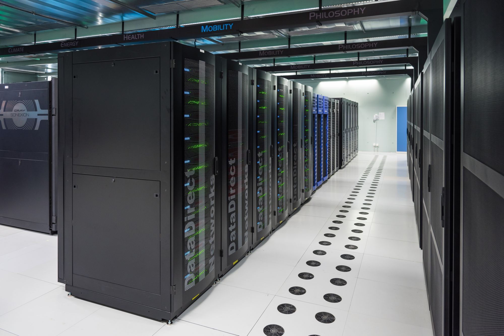

# Vega - High Performance Computing (HPC)

I would like to preface this document by stating that I am not an HPC expert. The information provided here is based on my own experiences and research. If you are an HPC expert and notice any inaccuracies or have suggestions for improvement, please feel free to contribute or reach out to me.


[Source: Julios Blog](https://www.juliosblog.com/high-performance-computing-hpc-on-openstack-a-few-recommendations/)

Above is an example of what a high performance computing (HPC) cluster might look like. HPC clusters are used for complex computations that require significant processing power, such as scientific simulations, data analysis, and machine learning tasks.

## 1. What is an HPC? ##

An HPC (High Performance Computing) cluster is a **group of powerful interconnected computers (nodes)** that work together to perform complex computations much faster than a single computer.

Each node has its own CPU, memory, and storage, and all nodes communicate over a high-speed network to act as one system. While a personal computer might have 4–16 cores and up to 64 GB of RAM, an HPC cluster can include hundreds or thousands of nodes, each with dozens of cores and hundreds of gigabytes or even terabytes of memory.

This setup allows large-scale simulations, data processing, and scientific calculations to be completed in a fraction of the time it would take on a single machine.

Here is a general breakdown of what different machines might look like:
| Machine Type        | Example Hardware       | Total Cores       | Total RAM               | Runtime**                         |
|---------------------|-----------------|-----------------|-------------------|------------------------------------|
| Personal Computer   | AMD Ryzen 9 7950X    | 16    | 32 GB      | ~14 days    |
| Workstation         | AMD EPYC 9654   | 96   | 256 GB   | ~3 days     |
| **Vega**          | 42 nodes with x2 AMD EPYC 9654 per node  | 8,064  | 63 TB    | ~11–12 hours      |
| NASA Pleiades      | Mixture of hardware | 232,416 | 873 TB | ~5–6 hours |

The above runtimes are made up for illustrative purposes. Actual runtimes will vary based on the specific hardware, software, and simulation physics. There are also some additional nuances to consider, such as administrative limits on resources you can use and the non-linear scaling of performance with increased cores, which will be discussed later. The key takeaway is that HPC clusters like Vega provide a massive increase in computational power compared to personal computers and workstations, enabling researchers to tackle problems that would otherwise be infeasible. (If anyone has any realistic runtime estimates for different hardware setups running Star-CCM+ simulations, please let me know so I can update the table above.)


### You should use a HPC when: ###
- Your computations need **more processing power or memory** than your computer or workstation can provide.
- The workload can be **split into smaller, independent parts** that run in parallel
- You need to run **many simulations** or data analyses **simultaneously**.
- You want to free up your local computer while long jobs run remotely.

### You should NOT use a HPC when: ###
- Your tasks run quickly on your local computer or don’t need high performance.
- The code cannot run in parallel (or isn’t designed for it).
- You’re doing interactive or graphical work (e.g., GUI tools, plotting large data live).

## 2. Logging in and Setup ##

WIP. This will serve as knowledge base to connect to Vega through mobaxterm or vs code remote ssh.

## 3. Storage and Compute Environment ##
Upon logging into Vega, you will be placed in your home directory, which is located at `/home2/<yourusername>`.

Vega uses a Linux-based file system, and you can navigate it using standard Linux commands (e.g., `ls`, `cd`, `cp`, `mv`, etc.).

It is also important to understand where to store your files and where your jobs actually run.

### 3.1 File System Layout ###
Vega has two main storage areas:

- **Home Directory**: `/home2/<yourusername>` - Your personal space for files and data.
- **Scratch Space**: `/scratch` - Fast, temporary storage for running jobs and large intermediate files. Typically not backed up on most HPCs.

Best practice:
Work and write output in `/scratch/<yourusername>`, then copy results you want to keep back to `/home2/<yourusername>` when done.


### 3.2 Node Types ###
Most HPCs, including Vega, have different types of nodes optimized for various tasks. Here are the common node types you might encounter:

| Node Type        | Purpose      | Example Hostname       | Usage                           |
|---------------------|-----------------|-----------------|-------------------|
| Login Node   | Where you initially connect. Shared by all users.    | `vegaln1`    | Edit, manage files, and submit jobs only.     |
| Compute Node         | Dedicated hardware for running jobs. Only the scheduled job can use it.   | `cn<##>` (e.g. `cn01`, `cn02`, etc.)   | Run simulations and parallel workloads through the job scheduler.    |

You should not run intensive computations on the login nodes, as this can affect other users. Instead, use them to prepare your job scripts and submit jobs to the compute nodes.

### 3.2 Job Submission ###
By now you should understand Vega's layout and how you should use `/home2` for saving files, `/scratch` for running jobs, and only performing computations on the compute nodes through the job scheduler. But how do you actually access a compute node and how can we use the job scheduler?

When you first log into Vega via SSH, you are placed on a login node and your terminal prompt will look something like this:

`[<yourusername>@vegaln1 ~]$`

where the `vegaln1` part indicates that you are currently on a login node. If you connect to a compute node directly (which typically should not be done unless you are an admin), the prompt would look something like this:

`[<yourusername>@cn01 ~]$` (or whatever compute node you are on)

Okay so, I can only run jobs on a compute node, but I'm not allowed to connect to one directly unless I'm an admin. How do I access a compute node then? This is where the job scheduler comes into play.

### Job Scheduler Analogy ###
Think of it like this: You and many other researchers are department heads in a company. You all have important projects (simulations) that need to be done. There are many employees (compute nodes) available, but if every department head sent tasks directly, it would be chaotic and employees would be overwhelmed. Instead, each department head submits their project requests to a single floor manager (the job scheduler).

The manager:
- Reviews all incoming project requests.
- Checks which employees are free.
- Assigns the right tasks to the right people based on availability and skill (resources like CPU, memory, and runtime).

If all of the employees are busy, the manager will hold your request in a queue until someone becomes available. Once an employee is assigned to your project, they will work on it and report back when it's done. Most clusters also limit how many employees or tasks each department head can use at once to ensure fair and efficient use of the system.

The job scheduler on Vega is managed by the Moab Workload Manager and the underlying resource manager is TORQUE. We won't dive deep into the specifics of Moab and TORQUE, but it's good to know what they are since different clusters may use different job schedulers (e.g., SLURM, PBS, etc.). TORQUE is also a derivative of the original PBS job scheduler, so many PBS commands might also work on Vega. For now we can just treat Moab/TORQUE as a black box that manages job submissions and resource allocation.

## 4. Submitting and Managing Jobs ##
To run anything on Vega, you will need two things:
1. A job scheduler to manage resource allocation and job queuing (Vega uses Moab/TORQUE).
2. A job script that tells the scheduler what to run and what resources to request.

The job script is simply a bash script containing commands and directives that define how many nodes and cores to use, how long the job should run, and what program to execute. Here’s an example job script for running a simple simulation:

```bash
#!/bin/bash
#PBS -N my_simulation_job          # Job name
#PBS -q longq                      # Queue name
#PBS -l nodes=2:ppn=192            # Request 2 nodes with 192 processors per node (total 384 cores)
#PBS -l walltime=02:00:00          # Maximum runtime of 2 hours (HH:MM:SS)

# Load necessary modules (programs/libraries)
module load starccm/versionNumber

# Define environment variables
export LICENSE_FILE=/path/to/license/file

# Execute the simulation (runs starccm+ with the amount of cores specified at the top of the file)
starccm+ -np $PBS_NP $LICENSE_FILE -batch my_simulation_input.sim

# Additional commands can go here to clean up or process results
```

Submit the job to the scheduler with:

```bash
qsub my_job_script.sh
```

This will place your job in the queue. Once resources are available, the scheduler will run it on a compute node and manage everything automatically. Note that this is a crude example and will not actually work on Vega as-is. You will need to modify it based on your specific simulation software, input files, and resource requirements. We will cover this in more detail later and I will provide an example job script tailored for running Star-CCM+ on Vega.

### 4.1 Job Script Directives ###
The lines that start with `#PBS` are directives that tell the scheduler what resources your job needs and how to handle it. These include the job name, queue, node and core counts, memory, walltime, and other settings. They **must be at the top of the script** before any executable commands. Anything above them (except the shebang `#!/bin/bash`) will be ignored by the scheduler.

> **Note about the shebang**  
> The first line `#!/bin/bash` is called a **shebang**. It tells the system to use the **bash shell** to interpret the script, which is standard for most job scripts. Without it, the system might use a different shell (e.g., `sh`, `zsh`, `tcsh`, `ksh`), which could lead to unexpected behavior.  
>
> In simple terms, different shells are like **different programming languages** — each follows its own syntax and rules. A script written for one shell (e.g., `bash`) might not run correctly in another (e.g., `tcsh` or `zsh`). That’s why we include the shebang (`#!/bin/bash`): to ensure the right “language” interprets the commands.  
>
> I won’t go into detail about shells here, but if you’re new to bash, it’s worth skimming a basic tutorial.


Back to the job script directives, here are additional common ones you might use:
<details>
<summary>Example Directives</summary>
<b>Note:</b> The <code>#PBS</code> prefix is omitted below for clarity, but each directive must start with it.

| Directive | Description | Example |
|------------|--------------|----------|
| `-N` | Sets the job name. | `-N LES_Scramjet` |
| `-q` | Specifies which queue to submit to. | `-q longq` |
| `-l nodes=#:ppn=#` | Requests number of nodes and processors per node | `-l nodes=2:ppn=192` |
| `-l mem=#gb` | Requests total memory | `-l mem=16gb` |
| `-l walltime=HH:MM:SS` | hh:mm:ss of time the job should run | `-l walltime=02:00:00` |
| `-o <file>` | Redirects standard output | `-o my_job_output.log` |
| `-e <file>` | Redirects standard error | `-e my_job_error.log` |
| `-M <email>` | Email for job notifications | `-M user@domain.com` |
| `-m <option>` | When to send emails (`b`, `e`, `a`, `n`) | `-m bea` |
| `-A <account>` | Specifies billing/project account | `-A my_project` |

Note that -e and -o can be combined into one file using -j oe to join standard output and error into a single file.
</details>

### 4.2 Available Resources ###
Vega consists of 42 compute nodes, each with 2× AMD EPYC 9654 CPUs (96 cores each) and 1.5 TB RAM, totaling 8,064 cores and 63 TB of memory.
Additionally, there are 2 GPU nodes, each equipped with 4× NVIDIA H100 (80 GB VRAM each) providing 320 GB of GPU memory per node.

To ensure fair usage, users are limited to:
- **Max 4 nodes** (768 cores) per user at a time
- **Max walltime**: 5 days per job (```longq```)
- **Max queued jobs**: 4 additional jobs per user

Example: if you submit 4 jobs using 1 node each, new submissions will wait in the queue until a job finishes. The same applies if a single job uses 4 nodes where no additional jobs can run until it completes. Any additional jobs (up to four) will queue until resources free up. Jobs exceeding these limits will be rejected.

> Vega has 3 queues:
> - `shortq`: for jobs up to 2 hours.
> - `mediumq`: for jobs up to 1 day.
> - `longq`: for jobs up to 5 days.
>
> The choice of queue affects prioritization of jobs. Shortq jobs generally have higher priority than longq jobs. Additionally, jobs with fewer nodes and shorter walltimes are prioritized over larger, longer jobs. This helps ensure that smaller tasks can complete quickly without being blocked by large jobs. Take this into account when selecting the queue and requesting resources.

**Important**: Jobs exceeding their walltime are terminated automatically. Always request slightly more time than you expect, but not excessively.
If a run is nearing its limit, you can stop it manually and resubmit.
Note that directives (e.g., walltime, nodes, ppn) cannot be changed after submission. You must cancel and resubmit the job.

### 4.3 Environment Modules ###
Vega uses the Environment Modules system to manage software and their dependencies.
This allows multiple versions of the same software to coexist without conflict and makes it easy to load or switch between them using the `module` command.
By default, no modules are loaded when you log in.

View all available modules with:

```bash
module avail
```
Search for a specific software:

```bash
module avail <keyword>
```
Load a specific module/version:

```bash
module load <module>/<version>
```

Example:
<details>
<summary>Finding and loading available Star-CCM+ versions</summary>
Here is an example of searching for available Star-CCM+ versions on Vega:

```bash
[username@vegaln1 ~]$ module avail starccm

----- /apps/spack/share/spack/modules/linux-rocky8-zen4 -----
starccm/STAR-CCM+19.02.009-R8  starccm/STAR-CCM+19.04.007-R8  starccm/STAR-CCM+20.04.008-R8

[username@vegaln1 ~]$ module load starccm/STAR-CCM+20.04.008-R8
```
Note that there can be many different versions available depending on what has been installed on the system. This helps ensure compatibility with different simulation requirements.
</details>

**One last note about modules**: Some modules may not appear in the default search path. If you know where a module file is located, you can add its directory to the module search path using:

```bash
module use /path/to/modulefiles
```
On Vega, additional module files are located in `/apps/spack/share/spack/modules/linux-rocky8-zen4/`. You can add this path to your module search path with:

```bash
module use /apps/spack/share/spack/modules/linux-rocky8-zen4/
```

### 4.4 Default Environment Variables ###
When you submit a job, the scheduler automatically sets several environment variables that describe the job and its allocated resources. These can be useful for debugging, logging, or customizing your scripts.
                                                                                                                                             |


<details>
<summary>Example environment variables</summary>

| Variable | Description |
|------------|--------------|
| `PBS_NODEFILE`  | The path to the run-time generated node list file. In general, it is unnecessary to pass a machinefile parameter to mpirun as the job control system will assign hosts based on the nodes= and ppn= PBS parameters. |
| `PBS_GPUFILE`     | The path to the run-time generated gpu list file, if running on GPU nodes. |
| `PBS_NP`      | The total number of cores that will participate in the parallel job. |
| `PBS_NUM_NODES` | The actual number of compute nodes irrespective of number of cores that will participate in the parallel job. |
| `PBS_NUM_PPN` | The number of processors per node assigned to the job. |
| `PBS_O_WORKDIR` | The directory from which the job was submitted. |
| `PBS_O_HOME` | Home directory of user. |
| `PBS_O_HOST` | Host that job is currently running on. |
| `PBS_JOBID` | The ID that Torque assigned to the job. |
| `PBS_JOBNAME` | The name assigned to the job. |
| `PBS_QUEUE` | The queue in which the job is running. |
</details>

### 4.5 Submitting Jobs ###
Finally, we get to submitting jobs! At this point, you should have a good idea of what each part of the job script does, but there’s one last thing to keep in mind.

Remember how we mentioned running jobs in your scratch space (`/scratch/<yourusername>`) for better performance? If you try to run directly from your home directory, things can slow down a lot because of network file system latency. You might not notice it for small jobs, but for large simulations that read and write a lot of data, it can become a major bottleneck.

In general, it’s best practice to always run jobs from scratch space and only copy back important results to your home directory when finished. My workflow usually looks something like this:

1. Create a project folder in my home directory for organization, e.g., `/home2/<yourusername>/LES_Airfoils/LES_NACA0012_AOA10`. This folder contains all input files (`.sim`, `.java`, `.py`, job submission script, etc.).
2. When I’m ready to run, I submit a job script that:
    - Creates a corresponding folder in my scratch space, e.g., `/scratch/<yourusername>/<jobid>_<jobname>_<date>`.
    - Copies the necessary input files from my home directory to this scratch folder.
    - Changes to the scratch directory.
    - Loads any required modules.
    - Executes the simulation command.
    - After completion, copies back important output files (logs, results, plots) to my home directory.
    - Cleans up the scratch folder to free up space.


This way, all heavy file I/O happens in the fast scratch space, while your home directory stays organized and lightweight. Always keep an eye on both your home and scratch usage to avoid clutter and excessive storage consumption.

You can check disk usage in any directory with:

```bash
du -sh *
```

Be considerate of other users and the overall system limits. Vega has about 1 PB of total storage, but that can fill up quickly when many users are running large simulations. For example, with 100 active users, that’s roughly 10 TB per user on average. That space can disappear fast when dealing with large CFD cases, especially transient simulations that output many time steps.

Make it a habit to regularly clean up old runs and keep only what you truly need. It keeps the system healthy and your workflow much smoother.


### 4.6 Monitoring and Job Control ###
You can monitor the status of your jobs using the `qstat` command:

```bash
[username@vegaln1 ~]$ qstat
Job ID                         Name                User            Time Use  S Queue
------------------------------ ------------------- --------------- --------- - ------------
12345.vegabk.head.cm.vega.era   my_simulation_job  username        00:10:00  R longq
```

Additionally, you can view the entire job queue with `showq` or check detailed job information with `qstat -f <jobid>`, where `<jobid>` is the 5-digit ID of your job. So in the example above you would run `qstat -f 12345`.

Finally, if you need to cancel a job, you can use the `canceljob <jobid>` command. This will terminate the job without saving or waiting for it to complete. Use this command if a job is misconfigured, no longer needed, or stuck.

## 5. Example Job Script for Star-CCM+ ##
Now that we’ve covered the basics of job submission, let’s look at two example Star-CCM+ job scripts: one for a single-case run and another for a Design Manager run.

<details>
<summary>Single Case</summary>

<br>

A **single-case** run is the simplest Star-CCM+ workflow.  
You run one simulation file (`.sim`), typically a single configuration, geometry, or set of conditions.

**Use this when:**
- You only need one simulation.
- You’re testing or debugging a setup.

<br>
In most workflows, you’ll use Java macros (`.java` files) to control and automate your simulation.

- **Java Macros** can automate actions such as meshing, initialization, data export, or report generation. You can use Star-CCM+’s built-in macros (like `mesh` or `run`) or create custom ones. Multiple macros can be chained together and executed in order using the `-batch` flag.

Example where we run a steady-state simulation then run a transient simulation, exporting results after each:
```bash
-batch  changeGeometry.java,mesh,SteadyState.java,run,exportSS.java,Transient.java,run,exportTransient.java
```
<br>
Additionally, you can use **INI files** to set or override simulation parameters at runtime.

- **.ini files** allow you to override simulation parameters (e.g., AoA, freestream velocity, RPM) at runtime. This is useful when you want to run the same `.sim` file with different conditions without editing it directly. You must have created corresponding parameters in the `.sim` file for this to work.

Example .ini file:
```
# Parameter.ini
-param AoA 5.0deg
-param freestream 50.0m/s
-param RPM_1 800.0rpm
```

<details>
<summary>View single run script</summary>
Now let's look at an example job script for a single-case Star-CCM+ run on Vega. This script runs a simulation called `Dragonfly_Descent_withBrownout.sim`, executing several Java macros in sequence and using an INI file to set parameters. It outputs logs and statistics for analysis. The scratch space is used for performance, and results are copied back to the home directory when done.

<br>

```bash
#PBS -S /bin/bash
#PBS -q longq
#PBS -l walltime=120:00:00
#PBS -l nodes=2:ppn=192
#PBS -N DFly_Descent


###Load Modules
module purge
module use /apps/spack/share/spack/modules/linux-rocky8-zen4
module load starccm/STAR-CCM+19.04.007-R8


#################################################################
# USER INPUTS
#################################################################
# Name of simulation file to run
export SIM_FILE="Dragonfly_Descent_withBrownout.sim"

# Name of output log file
export CASELOG="sim.out"

# Define macros to run (comma-separated, no spaces)
export MACROS="aLanderGeometry.java,mesh,bSteady.java,cProcessSteady.java,dUnsteady.java,eDescent.java";

# Define ini file to use (leave blank if none)
export INI="-ini Descent.ini"
#export INI=""  # uncomment if no ini file is used

# Define license information
export PODKEY="INSERTPODKEYHERE"
export LICS=1999@insertserver.school.edu

# Comment out to use PODKEY vs. license server
export LICOPT="-power -podkey $PODKEY"
export LICOPT="-power -licpath $LICS"

export STARCCM_USE_OFFSCREEN=true
export LIBGL_ALWAYS_INDIRECT=1
#################################################################


#################################################################
# AUXILLARY COMMANDS
#################################################################
# Move to directory where job was submitted (usually in home directory)
cd $PBS_O_WORKDIR
# Create file to display compute node names for debugging purposes
mkdir machineFiles
MACHINEFILE="machineFiles/machinefile.$PBS_JOBID.txt"
cat $PBS_NODEFILE > $MACHINEFILE

# Define scratch space location
export USERNAME=$(whoami)
export SCRATCH_ROOT="/scratch/${USERNAME}"

# Define location of job execution on scratch space
export JOBID_CLEAN="${PBS_JOBID%%.*}"
export DATE_STR=$(date +"%m-%d-%y")
export SCRATCH_TASK_DIR="$SCRATCH_ROOT/${JOBID_CLEAN}_${PBS_JOBNAME}_${DATE_STR}"

# Define original job submission location
export INITIAL_SUB_DIRECTORY="$PWD"
# Create copy on scratch space then move to location
mkdir -p "$SCRATCH_TASK_DIR"
rsync -av . "$SCRATCH_TASK_DIR"
cd "$SCRATCH_TASK_DIR"
#################################################################


#################################################################
# STARCCM+ EXECUTION
#################################################################
# Calculate elapsed time
start_time=$(date)
start_timestamp=$(date -d "$start_time" +%s)

###Run Job
starccm+ -jvmargs -Xmx25G -np $PBS_NP $INI -pio -rsh ssh -graphics mesa_swr -machinefile $MACHINEFILE $LICOPT -batch $MACROS $SIM_FILE &> "$CASELOG"

# Calculate elapsed time
end_time=$(date)
end_timestamp=$(date -d "$end_time" +%s)
elapsed_time=$((end_timestamp - start_timestamp))

days=$((elapsed_time / 86400))
hours=$(( (elapsed_time % 86400) / 3600 ))
minutes=$(( (elapsed_time % 3600) / 60 ))
seconds=$((elapsed_time % 60))
formatted_elapsed_time="${days} days ${hours} hours ${minutes} minutes ${seconds} seconds"

### Report statistics
grep 'Cells:' sim.out | awk 'END {print "Number of cells: " $2}' &>>stat.out
echo "Start Time: $start_timestamp" >> stat.out
echo "End Time: $end_timestamp" >> stat.out
echo "Elapsed Time: $formatted_elapsed_time" >> stat.out
echo "Number of Cores: $PBS_NP" >> stat.out
#################################################################

#################################################################
# You can add additional post-processing commands here.
#################################################################
# Maybe your simulation export .csv files and we want to generate
# plots from them using a Python script.

# or maybe you want to convert a string of images into a video
# using ffmpeg.

# python plot_results.py results.csv results.png
# ffmpeg <options> -i image_%04d.png output_video.mp4
#################################################################

#################################################################
# CLEANUP SCRATCH SPACE
#################################################################
# Create backup file location in original directory
BACKUPFILES="$INITIAL_SUB_DIRECTORY/inputFiles"
mkdir -p "$BACKUPFILES"
mv $INITIAL_SUB_DIRECTORY/* "$BACKUPFILES"

# Move finished simulation results to original directory
rsync -av . "$INITIAL_SUB_DIRECTORY"
cd $PBS_O_WORKDIR

# Remove scratch directory results
rm -r "$SCRATCH_TASK_DIR"
#################################################################
```
</details>
</details>


<details>
<summary>Design Manager</summary>
<br>

**Design Manager** is used when you want to automate and manage multiple Star-CCM+ cases. For example, **parameter sweeps, design studies, or optimization**.
Instead of manually submitting each case, Design Manager coordinates and tracks them for you, managing resources, results, and post-processing.

This approach is ideal when:
- You're running multiple simulations that differ by geometry, boundary conditions, or parameters.
- You want to perform design exploration, DOE (Design of Experiments), or optimization studies.

On Vega, each Design Manager run still uses a job script like a normal case, but instead of running a single simulation, the script launches Design Manager, which then manages multiple cases within that allocation.

There are two main ways to run Design Manager on HPC systems:
1. Pre-Allocation (required for Vega):
    
    You request all needed resources upfront in the job script. Design Manager then uses these resources to run multiple cases in parallel. (If you have a local scratch space, you must use this method.)
2. General Job Submission:
    
    There are two job scripts: one for the Design Manager controller and another for the individual case runs. The controller script submits a new job for each case as previous ones finish. You are not requesting all resources upfront, but instead relying on the scheduler to allocate them as needed. (This method is not supported on Vega due to lack of local scratch space, but I will outline it [here for completeness (WIP, link broken)](link/broken).)

<details>
<summary>View Pre-Allocation Design Manager Script</summary>
<br>
This example job script demonstrates how to run a Design Manager project on Vega using the pre-allocation method. It requests the necessary resources upfront and configures Design Manager to run multiple cases in parallel. In this example, we are running a project called `DFly_AOASweep_DM.dmprj`, which is setup to perform an angle of attack sweep for the Dragonfly model. We request 2 nodes with 192 cores each (384 total) and configure Design Manager to run 4 simultaneous jobs with 96 cores each.

<br>

In this setup, there are 100 total cases defined in the Design Manager project file. Design Manager will manage running these cases in parallel, up to 4 at a time, each using 96 cores. The job script handles copying files to scratch space, executing Design Manager, and cleaning up afterward.

<br>

Take note that you must select "Linux Cluster" as the compute resource in the Design Manager project file for this to work properly. All other settings in the design manager under compute resources can be left as default. You must also already have the Design Manager project file setup and configured (this will be covered in a future section).

```bash
#PBS -S /bin/bash
#PBS -q longq
#PBS -l walltime=120:00:00
#PBS -l nodes=2:ppn=192
#PBS -N DFly_AOASweep_DM

###Load Modules
module purge
module use /apps/spack/share/spack/modules/linux-rocky8-zen4
module load starccm/STAR-CCM+19.04.007-R8

#################################################################
# USER INPUTS
#################################################################
## MAKE SURE LINUX CLUSTER IS SELECTED "COMPUTE RESOURCES" IN DMPRJ FILE

## Name of DM Project. Must be in the WORKDIR
export DM_PROJECT="DFly_AOASweep_DM.dmprj"

export CASELOG="sim.out"

## Number of processors per job
NPROC_PER_JOB=96

## Number of simultaneous jobs
NSIMULT_JOB=4

# Define license information
export PODKEY="INSERTPODKEYHERE"
export LICS=1999@insertserver.school.edu

# Comment out to use PODKEY vs. license server
export LICOPT="-power -podkey $PODKEY"
export LICOPT="-power -licpath $LICS"

export STARCCM_USE_OFFSCREEN=true
export LIBGL_ALWAYS_INDIRECT=1
#################################################################

################################################################
# AUXILLARY COMMANDS
################################################################
## Work directory. No "/" at the end.
WORKDIR=$PWD

# Set number of processors per job in DM
sed -r -i "s/'NumComputeProcesses': [0-9]+/'NumComputeProcesses': ${NPROC_PER_JOB}/" $WORKDIR/$DM_PROJECT

# Set number of simultaneous jobs in DM
sed -r -i "s/'NumSimultaneousJobs': [0-9]+/'NumSimultaneousJobs': ${NSIMULT_JOB}/" $WORKDIR/$DM_PROJECT

# Move to directory where job was submitted
cd $PBS_O_WORKDIR
# Create file to display compute node names for debugging purposes
mkdir machineFiles
MACHINEFILE="machineFiles/machinefile.$PBS_JOBID.txt"
cat $PBS_NODEFILE > $MACHINEFILE

# Define scratch space location
export USERNAME=$(whoami)
export SCRATCH_ROOT="/scratch/${USERNAME}"

# Define location of job execution on scratch space
export JOBID_CLEAN="${PBS_JOBID%%.*}"
export DATE_STR=$(date +"%m-%d-%y")
export SCRATCH_TASK_DIR="$SCRATCH_ROOT/${JOBID_CLEAN}_${PBS_JOBNAME}_${DATE_STR}"

# Define original job submission location
export INITIAL_SUB_DIRECTORY="$PWD"
# Create copy on scratch space then move to location
mkdir -p "$SCRATCH_TASK_DIR"
rsync -av --exclude=".panfs*" . "$SCRATCH_TASK_DIR"
cd "$SCRATCH_TASK_DIR"
#################################################################

#################################################################
# STARCCM+ EXECUTION
#################################################################
# Calculate elapsed time
start_time=$(date)
start_timestamp=$(date -d "$start_time" +%s)

starlaunch --rsh /usr/bin/ssh \
--command "starccm+ -rsh /usr/bin/ssh -mpi openmpi -batch run $DM_PROJECT" \
--scratch_root $SCRATCH_ROOT \
--resourcefile $PBS_NODEFILE \
--slots 0 \
--outpath $CASELOG

# Calculate elapse time
end_time=$(date)
end_timestamp=$(date -d "$end_time" +%s)
elapsed_time=$((end_timestamp - start_timestamp))

days=$((elapsed_time / 86400))
hours=$(( (elapsed_time % 86400) / 3600 ))
minutes=$(( (elapsed_time % 3600) / 60 ))
seconds=$((elapsed_time % 60))
formatted_elapsed_time="${days} days ${hours} hours ${minutes} minutes ${seconds} seconds"

echo "Start Time: $start_timestamp" >> stat.out
echo "End Time: $end_timestamp" >> stat.out
echo "Elapsed Time: $formatted_elapsed_time" >> stat.out
#################################################################

#################################################################
# CLEANUP SCRATCH SPACE
#################################################################
# Create backup file location in original directory
BACKUPFILES="$INITIAL_SUB_DIRECTORY/inputFiles"
mkdir -p "$BACKUPFILES"
mv $INITIAL_SUB_DIRECTORY/* "$BACKUPFILES"

# Move finished simulation results to original directory
rsync -av --exclude=".panfs*" . "$INITIAL_SUB_DIRECTORY"
cd $PBS_O_WORKDIR

# Remove scratch directory results
rm -r "$SCRATCH_TASK_DIR"
#################################################################
```
</details>

</details>

## 6. Summary of Vega Hardware/Software ##
### Hardware ###
- **Compute Nodes**: 42 nodes, each with 2× AMD EPYC 9654 CPUs (96 cores each) and 1.5 TB RAM, totaling 8,064 cores and 63 TB of memory.
- **GPU Nodes**: 2 nodes, each with 4× NVIDIA H100 (80 GB VRAM each) providing 320 GB of GPU memory per node.
- **Interconnect**: 100Gb InfiniBand port
- **Storage**: 1 PB of shared storage user home storage and 1 PB of high-performance scratch space (Lustre file system).
- **Job Scheduler**: Moab Workload Manager with TORQUE resource manager.
- **Operating System**: Rocky Linux 8.7 (Green Obsidian)
- **CPU Architecture**: AMD Zen 4, 5nm, 2.4 GHz base clock, 3.7 GHz boost clock.
- **GPU Architecture**: NVIDIA Hopper H100, 80 GB VRAM, 3rd generation Tensor Cores.

### Software ###
- **Over 100 scientific and engineering applications**
- **Star-CCM+**: 19.02.009-R8, 19.04.007-R8, 20.04.008-R8
- **ANSYS Fluent**: R2310, R2410, R2510
- **OpenFOAM**: 2.4.0 (OpenFOAM-org), 1912_220610, 2312
