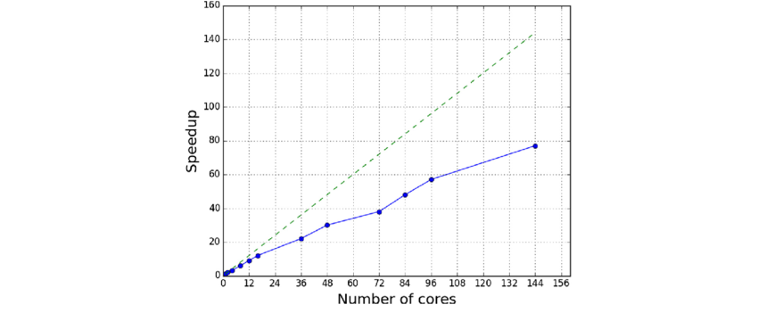

# Resource Selection and Planning

## 1. How to choose resources for your job ##
Star-CCM+ is primarily memory-bound, meaning performance depends more on memory capacity and bandwidth than pure CPU speed. Each mesh cell requires a certain amount of RAM, typically 1–4 GB per million cells, depending on physics models and solver settings.

### Memory requirements for meshing and solving:
- **Surface Meshing**: approximately 0.5 GB per million surface triangles.
- **Volume Meshing (Polyhedral)**: approximately 1 GB per million cells.
- **Volume Meshing (Trimmed)**: approximately 0.5 GB per million cells.

When solving, memory use increases with physics complexity. For a **single-phase RANS** simulation using a **two-equation turbulence model** (**serial run**):

| Type of Simulation | Polyhedral Cells | Trimmed Cells |
|--------------------|------------------|----------------|
| Segregated | 1 GB per million cells | 0.5 GB per million cells |
| Coupled Explicit | 2 GB per million cells | 1 GB per million cells |
| Coupled Implicit | 4 GB per million cells | 2 GB per million cells |

> Note:
> - Polyhedral meshes typically double the RAM requirement
> - Parallel runs introduce slight memory overhead due to inter-node communication
> - Always leave some buffer (10-20%) to avoid running out of memory

### Cell-to-Core Ratio and Scaling Efficiency ###
For efficient scaling, target 50,000–100,000 cells per core.
This keeps each core busy without excessive communication overhead.

One on Vega compute node (192 cores, 1.5 TB RAM):
- Minimum: 9.6 million cells (50,000 cells/core)
- Maximum: 19.2 million cells (100,000 cells/core)

### Theoretical vs. Practical Limits ###
Theoretical memory limit (1.5 TB RAM, 0.5–4 GB per million cells):
- You can achieve ~375–3,000 million cells
- However, this is impractical due to core count and scaling efficiency. The runtime would be extremely long and parallel efficiency very poor.

In practice, using the 50k-100k cells per core guideline:
- Estimate closer to 10-20 million cells per compute node on Vega.
- This allows a reasonable number of cores while maintaining good parallel efficiency and manageable runtimes.

### Balancing Memory and CPU Cores ###
- **Memory/RAM** determines how large of a simulation you can run.
- **CPU cores** determine how fast it will run.

You could fit hundreds of millions of cells in memory, but without enough cores, it would take forever. Conversely, if you have many cores but not enough memory, your job will crash.

### Understanding Parallel Scaling ###
Scaling is not linear. Doubling cores does not halve runtime. Cells continuously exchange information with neighboring cells (pressure, velocity, turbulence, etc.), and communication overhead grows as more cores and nodes are added. 

**Analogy**:
Think of CFD like assembling an airplane. Each section of a plane (wings, fuselage, tail, electronics, etc.) must be built separately, but assembly can't happen until neighboring sections are ready. Adding more workers (cores) helps, but if there are too many, they spend more time waiting for others to finish their parts than actually working.

Similarly, in CFD, each cell depends on updates from nearby cells.
Too many cores lead to more time spent syncing and sharing data than actually solving.

**Parallel Efficiency**:
Below is an example of parallel scaling. This data is unrelated to Star-CCM+ or Vega, but it illustrates the concept well. As you increase core count, speedup improves almost linearly at first, but efficiency drops as communication overhead increases.

[Source: Y. Thorimbert, et. al., "Virtual Wave Flume and Oscillating Water Column Modeled by Lattice Boltzmann Method and Comparison with Experimental Data](https://www.researchgate.net/publication/301241406_Virtual_Wave_Flume_and_Oscillating_Water_Column_Modeled_by_Lattice_Boltzmann_Method_and_Comparison_with_Experimental_Data)

---
Next Topic: [Summary of Vega Hardware/Software](docs/Appendix_Vega_Reference.md)